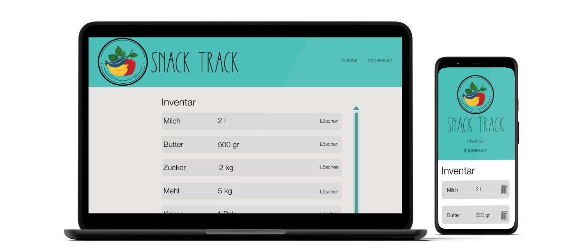

# EPWS2324Fuhrmann_Maurer

## Eine Ausführliche und strukturierte Sammlung der Projektergebnisse sind im Wiki des Repositorys zu finden 

### Projektkommunikation von Angelina Maurer und Sebastian Fuhrmann über Notion:

link: https://modern-oatmeal-3af.notion.site/Entwicklungsprojekt-237c60b22ae0411383fa90e491e709b3?pvs=4

## Projektrisiken 

1. **Technologische Risiken:**
    - **Hardwarefehler:** Probleme mit der Scanner-Hardware könnten auftreten, was zu Ausfällen oder ungenauen Scans führt.
    - **Kompatibilitätsprobleme:** Schwierigkeiten bei der Integration des Scanners mit anderen Systemen oder Geräten in der Umgebung.
2. **Datenschutz und Sicherheit:**
    - **Datenlecks:** Die gesammelten Informationen könnten durch unsachgemäße Sicherheitsmaßnahmen gefährdet werden.
    - **Unbefugter Zugriff:** Risiken in Bezug auf den Zugriff auf die Datenbank und die Sicherheit der gespeicherten Informationen.
3. **Regulatorische Risiken:**
    - **Compliance-Anforderungen:** Das Projekt muss möglicherweise verschiedenen gesetzlichen Vorschriften und branchenspezifischen Standards entsprechen, insbesondere im Bereich Lebensmittelsicherheit und Datenschutz.
4. **Benutzerakzeptanz:**
    - **Schulungsbedarf:** Benutzer müssen möglicherweise geschult werden, um den Scanner effektiv zu nutzen.
    - **Benutzerfreundlichkeit:** Wenn die Benutzeroberfläche nicht intuitiv ist, könnte dies zu Akzeptanzproblemen führen.
5. **Projektmanagement:**
    - **Verzögerungen:** Unvorhergesehene Probleme könnten zu Verzögerungen bei der Projektumsetzung führen.
    - **Budgetüberschreitungen:** Die Kosten könnten höher sein als ursprünglich geplant.
6. **Lieferanten- und Beschaffungsrisiken:**
    - **Lieferantenprobleme:** Verzögerungen oder Qualitätsprobleme bei den Hardwarekomponenten könnten auftreten.
    - **Preisschwankungen:** Kosten für Hardwarekomponenten könnten steigen, was das Budget beeinträchtigen könnte.
7. **Änderungsmanagement:**
    - **Anforderungsänderungen:** Unvorhergesehene Änderungen in den Anforderungen könnten den Entwicklungsprozess beeinflussen.
    - **Ungenaue Spezifikationen:** Wenn die Anforderungen nicht klar definiert sind, könnte dies zu Missverständnissen und Fehlern führen.
8. **Umgebungsbedingte Risiken:**
    - **Umwelteinflüsse:** Der Scanner könnte durch Umweltbedingungen wie Temperaturschwankungen oder Feuchtigkeit beeinträchtigt werden

## Datenbank
Firebase bietet eine Vielzahl von Funktionen, die es zu einem attraktiven Backend-as-a-Service (BaaS) und Mobile-Backend-as-a-Service (MBaaS) machen. Hier sind einige Vorteile von Firebase im Vergleich zu anderen Anbietern:

1. **Einfache Integration:** Firebase bietet eine nahtlose Integration in verschiedene Plattformen, einschließlich iOS, Android, Web und Unity. Die SDKs sind gut dokumentiert und erleichtern die Implementierung von Funktionen in verschiedenen Anwendungen.
2. **Echtzeitdatenbank (Realtime Database):** Firebase bietet eine Echtzeitdatenbank, die in Echtzeit synchronisiert wird. Dadurch können Benutzer sofortige Updates erhalten, ohne die Seite aktualisieren zu müssen. Dies ist besonders nützlich für Anwendungen, die Echtzeitkollaboration oder Messaging benötigen.
3. **Authentifizierung:** Firebase bietet robuste Authentifizierungsdienste, die verschiedene Authentifizierungsmethoden unterstützen, einschließlich E-Mail/Passwort, soziale Anmeldungen (Google, Facebook, Twitter), Telefonnummer und mehr. Dies macht die Benutzerverwaltung einfach und sicher.
4. **Cloud Firestore:** Firebase bietet neben der Echtzeitdatenbank auch Cloud Firestore, eine NoSQL-Datenbank, die skalierbar und leistungsstark ist. Firestore ermöglicht komplexe Abfragen und unterstützt Echtzeit-Updates.
5. **Cloud Functions:** Firebase ermöglicht das Schreiben von serverseitigem Code mithilfe von Cloud Functions. Dadurch können Sie benutzerdefinierte Logik implementieren, die in Reaktion auf bestimmte Ereignisse, wie das Hinzufügen eines neuen Datensatzes oder das Authentifizieren eines Benutzers, ausgelöst wird.
6. **Hosting und Cloud Storage:** Firebase bietet Hosting-Services für Webanwendungen und Cloud Storage für die Speicherung von Dateien. Die Integration ist einfach, und Sie können problemlos statische und dynamische Inhalte hosten.
7. **Analytics und Crash Reporting:** Firebase bietet integrierte Analysetools, mit denen Sie das Nutzerverhalten verstehen und die Leistung Ihrer Anwendung überwachen können. Darüber hinaus gibt es Funktionen für das Crash-Reporting, um Fehler schnell zu identifizieren und zu beheben.
8. **Push-Benachrichtigungen:** Firebase unterstützt das Senden von Push-Benachrichtigungen an iOS- und Android-Geräte, was für Benutzerbindung und Benachrichtigungen in Echtzeit wichtig ist.
9. **Automatisches Skalieren:** Firebase skaliert automatisch, um den Anforderungen Ihrer Anwendung gerecht zu werden. Dies ermöglicht eine einfache Skalierbarkeit, ohne dass Sie sich um die Infrastruktur kümmern müssen.
10. **Kostenloses Nutzungskontingent:** Firebase bietet ein großzügiges kostenloses Nutzungskontingent, was besonders für kleinere Projekte oder Entwickler mit begrenztem Budget attraktiv ist.

Quelle: https://firebase.google.com/?hl=de&authuser=0

## Architekturmodell

## Style Prototype
Der in Figma angefertigte Design Prototype kann unter folgenden Links abgerufen werden:
    - Desktop Version: https://www.figma.com/proto/MUbH2I6k6Payi9Em3XGpp0/snackTrack?page-id=0%3A1&type=design&node-id=3-538&viewport=-616%2C-115%2C0.51&t=qWLuklvVaLPSPSLs-1&scaling=scale-down&starting-point-node-id=3%3A538&mode=design
    - Mobile Version: https://www.figma.com/proto/MUbH2I6k6Payi9Em3XGpp0/snackTrack?page-id=88%3A48&type=design&node-id=88-53&viewport=-10%2C-45%2C1.49&t=ypoM6CpmxFAoCmdx-1&scaling=scale-down&starting-point-node-id=88%3A49&mode=design

## Styleguide

## Artefakte 1. Audit (Ordner "Artefakte"):
- Projektplan
- Stakeholder
- Persona 
- Domänenmodell deskriptiv / präskriptiv
- Task Scenario
- Use Scenario

# Exposé: 
**System zur einfachen Erkennung und Organisation von Lebensmitteln** 

**Projektidee**:
Das System soll den Benutzern eine einfache und schnelle Möglichkeit bieten, ihre Lebensmittel zu verwalten. Die Software wird durch eine passende Erkennung der Lebensmittel erweitert, um das Hinzufügen von Zutaten zu erleichtern, indem sie die vorhandenen Lebensmittel anhand bestimmter Merkmale erkennt. Diese werden dann in einer Datenbank gespeichert und über ein Online-Inventar organisiert.

**Ziele**:

1. Effizientes Verwalten von Lebensmitteln über verschiedene Endgeräte.
2. Vereinfachtes Erfassen von Lebensmittel im Kühlschrank mithilfe einer passenden Erkennung.
3. Benutzerkonten besitzen unterteilte Nutzerbereiche innerhalb eines Lebensraumes. (zb. getrennte Benutzerkonten innerhalb einer Wohngemeinschaft)

**Umsetzung**:
Die Umsetzung der oben genannten Ziele erfordert eine intelligente Verbindung von Technologien und Datenquellen. Hier sind einige Schritte zur Implementierung:

1. **Benutzerregistrierung und -profile**: Benutzer können sich anmelden und persönliche Profile erstellen um Zugriff auf abgetrennte Bereiche zu erlangen, in denen sie ihre “eigenen” Lebensmittel einsehen können.
2. **Erfassung der Lebensmittel**: Benutzer können ihre Lebensmittel mit einer passenden Erkennung erfassen, um die verfügbaren Zutaten zu überwachen (und einsehen zu können).
3. **Art der Lebensmittelerfassung:** Benutzer können Lebensmittel in vereinfachter Form erfassen um die Online-Verwaltung der Lebensmittel zu füllen.
4. **Benutzeroberfläche**: Das System sollte alle Screengrößen unterstützen.

**Mögliche Herausforderungen**:

1. **Korrekte Lebensmittelerkennung**: Die korrekte Erkennung bei der Identifizierung von Lebensmitteln im Kühlschrank ist entscheidend für den Erfolg des Projekts.
2. **Art der Lebensmittelerkennung:** Die Lebensmittelerkennung kann etwa durch einen Barcode-Scanner, einer passenden AR-Software oder möglichen IoT-Devices realisiert werden.
3. **Benutzerfreundlichkeit**: Die Anwendung muss einfach und benutzerfreundlich gestaltet sein, um eine breite Akzeptanz zu erreichen und einen intuitiven Umgang zu ermöglichen.
4. **Korrektheit der Daten**: Die Anwendung sollte eine Korrektheit der angegebenen Daten sicherstellen.

**Ressourcen**:

Die Projektidee klingt vielversprechend und könnte die Art und Weise, wie Menschen ihre Lebensmittel verwalten und Einkäufe planen erheblich verbessern. Die Umsetzung erfordert jedoch eine sorgfältige Planung und Entwicklung, um die oben genannten Herausforderungen zu bewältigen und eine erfolgreiche Anwendung/Website zu schaffen.
