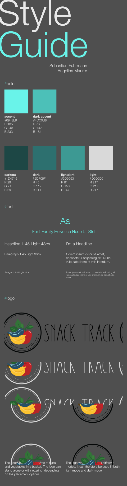

# EPWS2324Fuhrmann_Maurer

## Eine Ausführliche und strukturierte Sammlung der Projektergebnisse sind im Wiki des Repositorys zu finden 

### Projektkommunikation von Angelina Maurer und Sebastian Fuhrmann über Notion:

link: https://modern-oatmeal-3af.notion.site/Entwicklungsprojekt-237c60b22ae0411383fa90e491e709b3?pvs=4

## Architekturmodell

## Style Prototype
Der in Figma angefertigte Design Prototype kann unter folgenden Links abgerufen werden:
    - Desktop Version: https://www.figma.com/proto/MUbH2I6k6Payi9Em3XGpp0/snackTrack?page-id=0%3A1&type=design&node-id=3-538&viewport=-616%2C-115%2C0.51&t=qWLuklvVaLPSPSLs-1&scaling=scale-down&starting-point-node-id=3%3A538&mode=design
    - Mobile Version: https://www.figma.com/proto/MUbH2I6k6Payi9Em3XGpp0/snackTrack?page-id=88%3A48&type=design&node-id=88-53&viewport=-10%2C-45%2C1.49&t=ypoM6CpmxFAoCmdx-1&scaling=scale-down&starting-point-node-id=88%3A49&mode=design

## Styleguide

## Artefakte 1. Audit (Ordner "Artefakte"):
- Projektplan
- Stakeholder
- Persona 
- Domänenmodell deskriptiv / präskriptiv
- Task Scenario
- Use Scenario

# Exposé: 
**System zur einfachen Erkennung und Organisation von Lebensmitteln** 

**Projektidee**:
Das System soll den Benutzern eine einfache und schnelle Möglichkeit bieten, ihre Lebensmittel zu verwalten. Die Software wird durch eine passende Erkennung der Lebensmittel erweitert, um das Hinzufügen von Zutaten zu erleichtern, indem sie die vorhandenen Lebensmittel anhand bestimmter Merkmale erkennt. Diese werden dann in einer Datenbank gespeichert und über ein Online-Inventar organisiert.

**Ziele**:

1. Effizientes Verwalten von Lebensmitteln über verschiedene Endgeräte.
2. Vereinfachtes Erfassen von Lebensmittel im Kühlschrank mithilfe einer passenden Erkennung.
3. Benutzerkonten besitzen unterteilte Nutzerbereiche innerhalb eines Lebensraumes. (zb. getrennte Benutzerkonten innerhalb einer Wohngemeinschaft)

**Umsetzung**:
Die Umsetzung der oben genannten Ziele erfordert eine intelligente Verbindung von Technologien und Datenquellen. Hier sind einige Schritte zur Implementierung:

1. **Benutzerregistrierung und -profile**: Benutzer können sich anmelden und persönliche Profile erstellen um Zugriff auf abgetrennte Bereiche zu erlangen, in denen sie ihre “eigenen” Lebensmittel einsehen können.
2. **Erfassung der Lebensmittel**: Benutzer können ihre Lebensmittel mit einer passenden Erkennung erfassen, um die verfügbaren Zutaten zu überwachen (und einsehen zu können).
3. **Art der Lebensmittelerfassung:** Benutzer können Lebensmittel in vereinfachter Form erfassen um die Online-Verwaltung der Lebensmittel zu füllen.
4. **Benutzeroberfläche**: Das System sollte alle Screengrößen unterstützen.

**Mögliche Herausforderungen**:

1. **Korrekte Lebensmittelerkennung**: Die korrekte Erkennung bei der Identifizierung von Lebensmitteln im Kühlschrank ist entscheidend für den Erfolg des Projekts.
2. **Art der Lebensmittelerkennung:** Die Lebensmittelerkennung kann etwa durch einen Barcode-Scanner, einer passenden AR-Software oder möglichen IoT-Devices realisiert werden.
3. **Benutzerfreundlichkeit**: Die Anwendung muss einfach und benutzerfreundlich gestaltet sein, um eine breite Akzeptanz zu erreichen und einen intuitiven Umgang zu ermöglichen.
4. **Korrektheit der Daten**: Die Anwendung sollte eine Korrektheit der angegebenen Daten sicherstellen.

**Ressourcen**:

Die Projektidee klingt vielversprechend und könnte die Art und Weise, wie Menschen ihre Lebensmittel verwalten und Einkäufe planen erheblich verbessern. Die Umsetzung erfordert jedoch eine sorgfältige Planung und Entwicklung, um die oben genannten Herausforderungen zu bewältigen und eine erfolgreiche Anwendung/Website zu schaffen.
